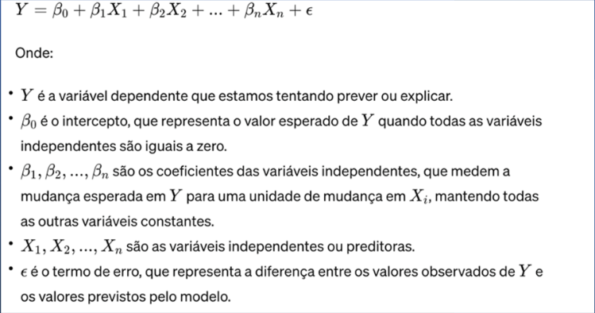
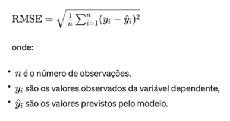
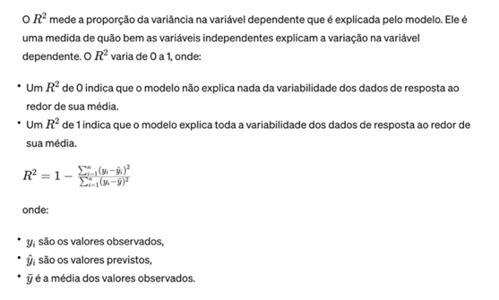

# Regressão Linear Múltipla

A Regressão Linear Múltipla é um método estatístico usado para modelar a relação entre uma variável dependente contínua e duas ou mais variáveis independentes.

É uma extensão da Regressão Linear Simples, que se limita a apenas uma variável independente

A Regressão Linear Múltipla permite:

* Prever o valor da variável dependente a partir de um conjunto de variáveis independentes.
* Investigar quais variáveis independentes se relacionam com a variável dependente.
* Determinar qual conjunto de variáveis independentes fornece a melhor explicação para a variável dependente.
* Compreender a relação entre a variável dependente e cada variável independente, controlando pelo efeito das outras variáveis.

O objetivo da regressão linear múltipla é encontrar os valores dos coeficientes (β) que minimizam a soma dos quadrados dos resíduos (a diferença entre os valores observados e os previstos de Y). Isso é geralmente feito usando o método dos mínimos quadrados. A regressão linear múltipla é amplamente usada em muitas áreas, como economia, ciências sociais, biologia, engenharia e outras, para entender e prever o comportamento de fenômenos complexos onde várias variáveis influenciam a variável de interesse. Alguns Exemplos de Aplicações da Regressão Linear Múltipla:
* Previsão de vendas: estimar as vendas de um produto com base em variáveis como preço, publicidade e renda.
* Análise de risco de crédito: avaliar o risco de inadimplência de um cliente com base em variáveis como renda, histórico de crédito e idade.
* Estudo do comportamento humano: investigar a relação entre o desempenho escolar e variáveis como nível socioeconômico, inteligência e tempo de estudo.

Para Realizar uma Análise de Regressão Linear Múltipla, é necessário:
* Coletar dados para as variáveis dependentes e independentes.
* Verificar os pressupostos da regressão linear, como a linearidade da relação entre as variáveis, a homocedasticidade dos erros e a normalidade da distribuição dos erros.
* Escolher um modelo de regressão que se ajuste aos dados.

Interpretar os resultados da regressão, como os coeficientes de regressão, o R² e o valor de p.

### Estimação de Parâmetros e Interpretação
A estimação de parâmetros na regressão linear múltipla e a interpretação desses parâmetros objetivam entender a relação entre as variáveis dependente e independentes. Os parâmetros (ou coeficientes) do modelo de regressão linear múltipla são estimados usando o método dos mínimos quadrados. Este método busca minimizar a soma dos quadrados dos resíduos (diferenças entre os valores observados e os valores previstos pela equação do modelo). A forma matemática para encontrar esses coeficientes envolve derivar uma equação normal a partir da função de custo (soma dos quadrados dos resíduos) e resolver um conjunto de equações lineares é dada por:

#### Interpretação dos Parâmetros
* Intercepto (βo): É o valor esperado da variável dependente Y quando todas as variáveis independentes são iguais a 0. Em muitos contextos, pode não ter uma interpretação prática, especialmente se 0 não estiver dentro do intervalo dos dados observados para as variáveis independentes.
* Coeficientes das variáveis independentes (β1, β2, ..., βn): Cada um desses coeficientes representa a mudança esperada na variável dependente Y para um aumento de uma unidade na variável independente correspondente, mantendo todas as outras variáveis constantes. Por exemplo, um coeficiente 3, = 3 significa que para cada aumento de uma unidade em X,, espera-se, em média, que Y aumente 3 unidades, assumindo que todas as outras variáveis independentes permaneçam constantes.

#### Significância dos Coeficientes

A significância estatística dos coeficientes é geralmente testada usando o teste t, que verifica se um coeficiente é significativamente diferente de zero. Isso ajuda a determinar se uma variável independente tem uma relação estatisticamente significativa com a variável dependente. Um coeficiente com um valor p baixo (tipicamente < 0,05) é considerado estatisticamente significativo, indicando que há evidências suficientes para afirmar que o efeito da variável independente sobre a variável dependente não é zero.

#### Multicolinearidade

Um desafio na regressão linear múltipla é a multicolinearidade, que ocorre quando duas ou mais variáveis independentes estão altamente correlacionadas entre si.Isso pode tornar a estimação dos coeficientes imprecisa e os resultados difíceis de interpretar. Ferramentas como o fator de inflação da variância (VIF) são usadas para detectar multicolinearidade. A estimação de parâmetros e a interpretação são essenciais para que você possa entender as relações modeladas pela regressão linear múltipla. Eles fornecem insights sobre como as variáveis independentes afetam a variável dependente e permitem fazer previsões. No entanto, é importante considerar as suposições do modelo e verificar se elas são atendidas para garantir interpretações e previsões válida

### Avaliação de Ajuste RMSE e Coeficiente de Determinação

A avaliação do ajuste de um modelo de regressão linear múltipla nos auxilia a entender quão bem o modelo se ajusta aos dados observados e para avaliar sua capacidade de fazer previsões precisas. As duas métricas comumente usadas para essa avaliação são a Raiz do Erro Quadrático Médio (RMSE, Root Mean Squared Error) e o Coeficiente de Determinação (R2).

#### Raiz do Erro Quadrático Médio da Raiz 
RMSE é uma medida da diferença entre os valores previstos pelo modelo e os valores observados, que oferece uma maneira de quantificar a magnitude dos erros do modelo. O RMSE é calculado pela raiz quadrada da média dos quadrados dos erros (as diferenças entre os valores observados e os previstos). Matematicamente, podemos representá-lo como:

Valores menores de RMSE indicam um melhor ajuste do modelo aos dados. O RMSE é particularmente útil porque é expresso nas mesmas unidades que a variável dependente, facilitando a interpretação.

#### Coeficiente de Determinação R2

O R2 é utilizado para avaliar a força da relação entre a variável dependente e as variáveis independentes. No entanto, é importante notar que um R2 alto não necessariamente indica que o modelo é apropriado. Por exemplo, um modelo pode ter um R2 alto mas sofrer de viés ou variância alta, ou não atender às suposições da regressão linear.

**Considerações**
* Interpretação Cautelosa: Ambas as métricas devem ser interpretadas com cautela. O RMSE e o R2 oferecem informações valiosas sobre o ajuste do modelo, mas não fornecem uma imagem completa por si só. Outras métricas e diagnósticos devem ser considerados juntamente com essas medidas.
* Complementaridade: RMSE e R2 complementam um ao outro; RMSE fornece uma medida absoluta do ajuste, enquanto R2 oferece uma medida relativa.
* Aplicabilidade: Embora estas métricas sejam amplamente utilizadas para avaliar modelos de regressão, elas têm suas limitações e devem ser usadas em conjunto com outras ferramentas e testes para uma avaliação completa do modelo.
  
O RMSE e o R2 são fundamentais para avaliar o ajuste de um modelo de regressão linear múltipla, mas sua interpretação deve ser feita no contexto de outras análises e considerando as características específicas dos dados e do modelo.