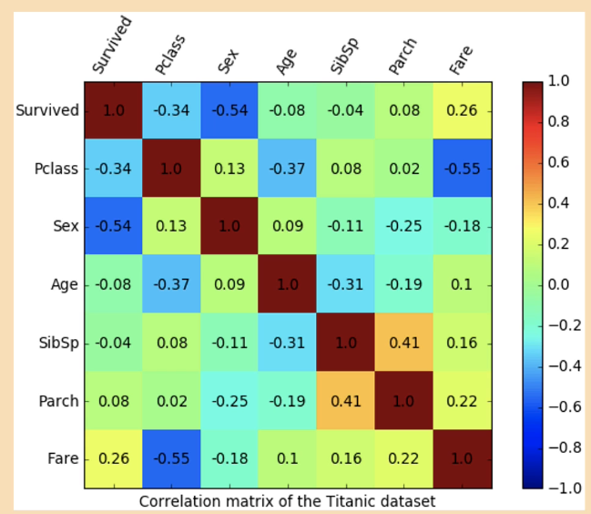
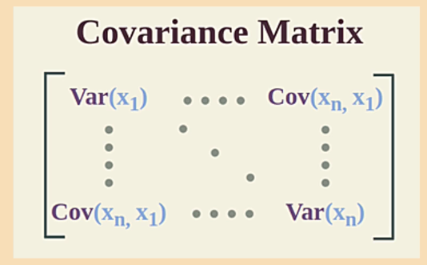
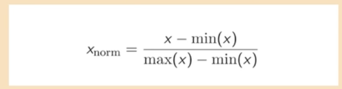
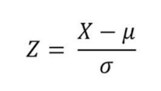
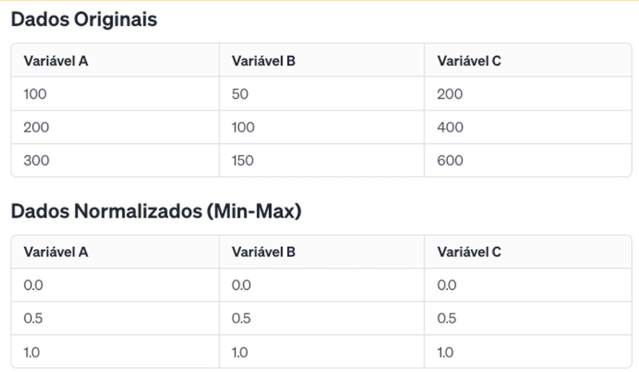

# Conceito e Aplicações da Análise Multivariada
 
É um conjunto de técnicas estatísticas usadas para analisar dados que contêm duas ou mais variáveis simultaneamente. Os principais objetivos incluem a identificação de padrões e relações entre variáveis, a redução da dimensionalidade dos dados (simplificando conjuntos de dados grandes em componentes mais gerenciáveis) e a classificação ou agrupamento de dados.

A Análise Multivariada inclui métodos como análise de componentes princiais (PCA), análise de cluster, análise de fatores, regressão multivariada e análise disciminante.

Exemplo de Aplicações:
* Ciências Sociais e Psicologia: usada para entender relações entre variáveis sociais ou psicológicas, como a influência de diversos fatores socioeconômicos no comportamente humano.
* Biologia e Medicina: Auxilia na compreensão de relações entre múltiplas variáveis biológicas, como os efeitos combinados de difernetes genes ou fatores ambientais na saúde.
* Marketing e Pesquisas de Mercado: permite que as empresas analisem padrões de consumo e preferências do cliente, integrando diversas variáveis como idade, gênero, renda e hábitos de compra.
* Finanças e Economia: Utilizada para modelar riscos e retornos de investimentos, analisando múltiplos indicadores econônicos e de mercado simultaneamente.
* Engenharia e Ciências da Computação: aplica-se no processamento de sinais, visão computacional e em sistemas de recomendação, onde múltiplas características são analisadas para tomar decisões ou fazer previsões.
* Vendas: Todo processo de venda envolve diversas variáveis, desde a produção de um item, passando pela sua comercialização, até as decisões de compra do cliente.

## Tipos de Dados

* Dados Quantitativos: são dados numéricos que representam quantidades mensuráveis. Eles são subdivididos em:
  * Contínuos: representam medições e podem assumir qualquer valor dentro de um intervalo. Ex.: peso, altura, temperatura
  * Discretos: representam contagens e só podem assumir valores inteiros. Ex.: número de filhos, número de carros
* Dados Qualitativos: são características e não são numericamente mensuráveis. Eles são subdivididos em:
  * Nominais: categorias sem uma ordem inerente. Ex.: tipo de animais, cores, nacionalidade.
  * Ordinais: categorias com uma ordem ou ranking definido. Ex.: classificação como baixo, médio, alto
  
## Escalas de Medida
* Escala Nominal: utilizada para dados qualitativos sem ordem. Permite a classificação de itens em grupos distintos. Ex.: gênero, tipo sanguíneo.
* Escala Ordinal: utilizada para dados qualitativos com ordem. Ex.: níveis de satisfação em uma pesquisa (insatisfeito, neutro, satisfeito).
* Escala Intervalo: utilizada para dados quantitativos, onde a distância entre os valores é significativa, mas não há um verdadeiro zero. Ex.: temperatura em Celsius ou Fahrenheit.
* Escala Razão: semelhante à escala de intervalo, mas com um zero absoluto, permitindo a compadração de razões. Ex.: peso, altura e distância.

## Medidas de Distância e Similaridade

Medidas de distância e similaridade são necessárias em diversas técnicas de análise multivariada, conforme veremos ao longo do curso. Elas são usadas para quantificar quão similares ou diferentes são os pontos de dados. Abaixo está uma lista de algumas das medidas mais comuns.

### Medidas de Distância 

* Distância Euclidiana: A mais comum, é a distância "em linha reta" entre dois pontos no espaço euclidiano. É apropriada para dados numéricos. 
* Distância de Manhattan: Calcula a soma das diferenças absolutas das coordenadas. É útil em grade-like paths, como em planejamento urbano. 
* Distância de Minkowski: Generalização das distâncias euclidiana e de Manhattan. Inclui um parâmetro que determina a importância dos maiores valores de diferença. 
* Distância de Chebyshev: A distância máxima ao longo de qualquer dimensão coordenada. Útil em jogos de tabuleiro que permitem movimentos em 8 direções.
* Distância de Hamming: Usada para dados categóricos, calcula o número de posições nas quais os correspondentes símbolos são diferentes. 
* Distância de Jaccard: Mede a dissimilaridade entre conjuntos e é o complemento do índice de Jaccard (uma medida de similaridade). 
* Distância de Mahalanobis: Leva em conta a correlação entre as variáveis e é útil para detectar outliers. 
* Distância de Canberra: Uma medida ponderada que é mais sensível a pequenas mudanças perto de zero, usada principalmente para dados positivos.

### Medidas de Similaridade
Coeficiente de Correlação de Pearson: Mede o grau de relação linear entre duas variáveis. Valores próximos de 1 ou -1 indicam forte relação positiva ou negativa, respectivamente.
* Similaridade Cosseno: Mede o cosseno do ângulo entre dois vetores no espaço multidimensional, frequentemente usado em processamento de linguagem natural para comparar documentos. 
* Índice de Jaccard (Coeficiente de Jaccard): Usado para comparar a similaridade e diversidade de conjuntos de amostras, calculado como o tamanho da interseção dividido pelo tamanho da união dos conjuntos. 
* Similaridade Dice: Semelhante ao índice de Jaccard, porém dá mais peso à interseção. 
* Similaridade de Overlap: Foca na interseção e é usada quando o tamanho dos conjuntos é importante. 

Cada uma dessas medidas tem suas próprias aplicações e adequações dependendo do tipo de dados e do contexto do problema. É fundamental escolher a medida mais apropriada para obter resultados significativos em qualquer análise de dados ou tarefa de aprendizado de máquina.

## Matriz de Correlação
É uma matriz quadrada que descreve as relações lineares entre as variáveis em um conjunto de dados multivariado. Ela é usada para medir a força e a direção das associações lineares entre as variáveis. Cada elemento da matriz de correlação contém o coeficiente de correlação entre as duas variáveis. O coeficiente vaira de -1 a 1, onde -1 indica uma correlação negativa perfeita, 1 indica uma correlação posititiva perfeita e 0 indica ausência de correlação linear.
A matriz de correlação é simétrica, o que significa que a correlação entre a variável X e Y é a mesma que correlação entre a variável Y e X.

## Matriz Covariância
É outra matriz quadrada que descreve as relações entre as variáveis em um conjunto de dados multivariado, mas ela leva em consideração náo apenas relações lineares, mas também as variações conjuntas entre as variáveis. Cada elemento contém a covariância entre duas variáveis. 
A covariância mede como duas variáveis variam juntas. Uma convariância positiva indica que as variáveis tendem a aumentar e diminuir juntas, enquanto uma covariância negativa indica que elas tendem a variar de maneira oposta. A matriz de convariância também é assimétrica.

## Média

A média é uma das medidas estatísticas mais fundamentais na Ciência de Dados. Ela representa o valor central em um conjunto de números. Para calcular a média, você soma todos os valores do conjunto de dados e divide essa soma pelo número total de valores. A média é frequentemente usada na Ciência de Dados para analisar a tendência central dos dados. No entanto, ela pode ser sensível a outliers, ou seja, valores muito altos ou muito baixos que podem distorcer a média.

## Desvio Padrão

O desvio padrão é uma medida que indica a quantidade de variação ou dispersão em um conjunto de dados. Em outras palavras, ele mostra quão espalhados estão os dados em relação à média. Um desvio padrão baixo significa que os dados estão agrupados perto da média, enquanto um desvio padrão alto indica que os dados estão mais espalhados. O desvio padrão é uma medida útil na Ciência de Dados porque ajuda a entender a distribuição dos dados. Ele é amplamente utilizado em análise exploratória de dados, para entender a variabilidade dos dados, e em modelos estatísticos e de aprendizado de máquina, para entender como os diferentes algoritmos podem se comportar com diferentes tipos de distribuições de dados.

## Distribuição Normal

A Distribuição Normal, também conhecida como Distribuição Gaussiana, é uma das distribuições estatísticas mais importantes e comumente usadas em várias áreas, incluindo ciência de dados, estatística, engenharia e ciências sociais. Aqui estão os principais aspectos da Distribuição Normal: Forma de Sino: A Distribuição Normal tem uma forma característica de sino, sendo simétrica em torno da média. Isso significa que a maioria dos dados está perto da média e a frequência de dados diminui conforme você se afasta da média para ambos os lados. A imagem abaixo ilustra a curva da distribuição normal:

Definida por Dois Parâmetros: A distribuição é completamente definida por dois parâmetros: a média (µ) e o desvio padrão (σ). A média determina o centro da distribuição, enquanto o desvio padrão determina o quão "larga" é a distribuição, ou seja, a dispersão dos dados. 
Propriedades de Área: A área sob a curva da Distribuição Normal totaliza 1. Isso implica que a probabilidade de um ponto de dados aleatório cair em algum lugar sob a curva é 1. Além disso, cerca de 68% dos dados caem dentro de um desvio padrão da média, cerca de 95% dentro de dois desvios padrão e cerca de 99,7% dentro de três desvios padrão (Regra 68-95-99.7 ou Regra Empírica). 
Uso na Inferência Estatística: Na ciência de dados e estatística, a Distribuição Normal é frequentemente usada em testes de hipóteses e na construção de intervalos de confiança. Muitos testes estatísticos (como o teste t de Student) assumem que os dados seguem uma distribuição normal. 
Normalidade e Outras Distribuições: Muitas variáveis em estudos naturais e sociais tendem a seguir uma distribuição normal, especialmente quando o tamanho da amostra é grande, devido ao Teorema Central do Limite. 
No entanto, nem todos os conjuntos de dados seguem uma distribuição normal, e é importante testar a normalidade dos dados antes de aplicar técnicas que assumem essa distribuição. 
A Distribuição Normal é fundamental devido à sua universalidade e às propriedades matemáticas que facilitam o cálculo e a análise de probabilidades. É uma ferramenta essencial para entender e modelar fenômenos que têm variação aleatória.

## Distribuição Multinomial e Multivariada Normal

A **distribuição multinomial** é uma distribuição de probabilidade discreta que é usada para modelar variáveis categóricas ou discretas que têm mais de duas categorias. Ela é uma extensão da distribuição binomial, que lida com variáveis com apenas duas categorias (por exemplo, sucesso ou fracasso). 
A distribuição multinomial descreve a probabilidade de ocorrência de várias categorias diferentes em uma única tentativa ou observação. Ela é caracterizada pelos parâmetros que especificam as probabilidades de cada categoria. 
Por exemplo, se estivermos analisando o resultado de uma pesquisa de opinião política com três candidatos (A, B e C), a distribuição multinomial pode ser usada para modelar a probabilidade de cada candidato ser escolhido por um eleitor.

A **distribuição multivariada normal** (também conhecida como distribuição gaussiana multivariada) é uma distribuição de probabilidade contínua que é usada para modelar conjuntos de variáveis aleatórias contínuas que estão correlacionadas entre si. 
Ela é uma extensão da distribuição normal univariada, que lida com uma única variável aleatória contínua. Na distribuição multivariada normal, as variáveis aleatórias são organizadas em um vetor e são caracterizadas por dois parâmetros principais: um vetor de médias (que especifica o valor médio de cada variável) e uma matriz de covariância (que especifica como as variáveis estão correlacionadas). 
A distribuição multivariada normal é frequentemente usada em análise estatística multivariada, como análise de componentes principais e análise discriminante, para modelar conjuntos de dados onde as variáveis estão inter-relacionadas.

## Normalização
É usada para redimensionar os valores dos dados para um intervalo comum, sem distorcer as diferenças nos intervalos de valores. Normalmente, os dados são redimensionados para um intervalo entre 0 e 1. Isso é útil quando os dados têm diferentes escalas e você quer compará-los de maneira equitativa.

A normalização é o processo de redimensionar os valores númericos no conjunto de dados para uma escala comum, sem distorcer as diferenças nos intervalos de valores ou perder informação. Geralmente, a normalização é feita para que os valores estejam entre 0 e 1. Isso é particularmente útil em casos onde as variáveis têm unidades diferentes ou uma ampla variação em seus intervalos. Métodos comuns de normalização:
* Min-Max Scaling: Redimensiona os dados para que fiquem dentro do intervalo [0,1]
* Normalização pela Soma: cada valor é dividido pela soma total dos valores.

## Padronização
A padronização é usada para redimensionar os dados de modo que eles tenham uma média de 0 e um desvio padrão de 1. Isso transforma os dados em uma distribuição normal (Gaussiana). É útil em algoritmos que assumem que os dados seguem uma distribuição normal.

É usada para redimensionar a distribuição dos valores de modo que a média dos valores observados seja 0 e o desvio padrão seja 1. Dessa forma, transforma-se os dados para terem uma distribuição com uma média e um desvio padrão especificos. Isso é útil em algoritmos que assumem que todos os recursos estão centrados em torno de zero e têm a mesma variação. Métodos comum de padranização:
* Z-Score Normalization: os valores são ajustados de acordo com a média e o desvio padrão dos dados, seguindo a fórmula mostrada anteriormente.

**Aplicabilidade**: A normalização é mais útil quando os dados não seguem uma distribuição normal e você precisa de uma escala comum. A padronização é preferivel quando os dados seguem uma distribuição normal.

**Escolha**: A escolha entre as duas técnicas depende do seu conjunto de dados e do algoritmo que você está utilizando. Alguns algoritmos, como redes neurais, muitas vezes se beneficiam da normalização, enquanto outros, como algoritmos baseados em distância, podem preferir a padronização.

